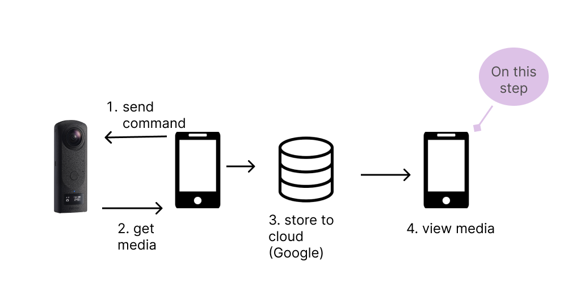

# 10. 360 Video Display from Cloud Storages

## Overview

This project displays 360 view of video files from commercial cloud storages: Github, Firebase, and Dropbox. It uses the example from the plugin called [video_360](https://pub.dev/packages/video_360).



## Project Structure

The app initial lists out the cloud storages tested in the project through a Column of IconButtons. In order to route to each screen, the project lists out the routes in the `main` method.

```dart
runApp(MaterialApp(
    home: const MyApp(),
    routes: <String, WidgetBuilder>{
      "/firebase": (BuildContext context) => FireBaseScreen(),
      "/dropbox": (BuildContext context) => DropBoxScreen(),
      "/github": (BuildContext context) => GithubScreen(),
    },
  ));
```

The command `Navigator.of(context).pushNamed("/github")` is run to push to a new screen. 

Each screen has `video_360` imported and uses the example from the plugin. To change the video source, the media url is changed in the `Video360View`. 

```dart
 child: Video360View(
                onVideo360ViewCreated: _onVideo360ViewCreated,
                url:
                    'https://codetricity.github.io/flutter_video_display/ageda.MP4',
```

Below is an example of a github media file in 360 view: 


## Additional Information

* The `video_360` plugin only works if the `build.gradle` file is edited. Add these two lines in the `defaultConfig` and `dependencies` section of the file.

        ```dart
        defaultConfig {
                multiDexEnabled true}
        dependencies {
            implementation 'androidx.multidex:multidex:2.0.1'
        }
        ```

* Issues arose when testing the project on the Android emulator. When the project runs on the physical device, however, there aren't any issues. It is recommended to build the application using a physical device. 

* The project outputs an `asynchronous suspension` in the debug console. However, it appears that the suspension can be ignored according to this
[discussion](https://stackoverflow.com/questions/60658945/asynchronous-suspension-in-stacktrace-output-in-flutter).

